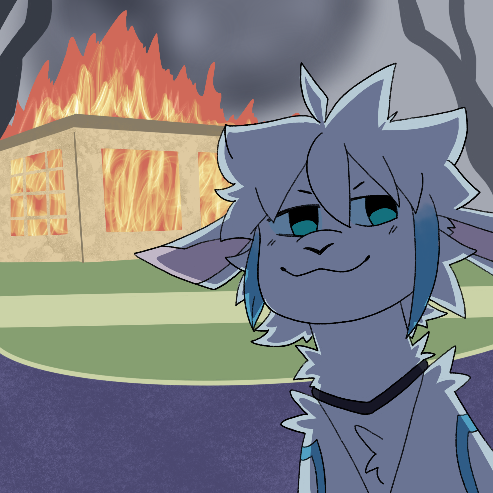

# StopPanFromBurningDownTheirHouse-Fabric
Disable fire ticking within a certain radius around a certain player, both of these are configurable.

To use it, start the world once and close it, then open `config/SPFBDTH.json`. The config should speak for itself.

*Cover art: © 2023 FlickeringPyre*
